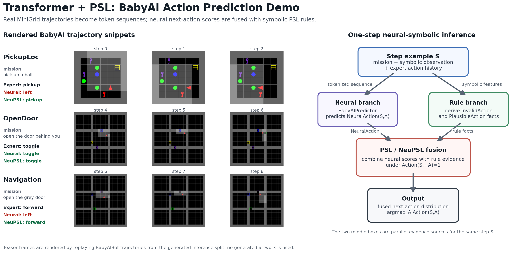
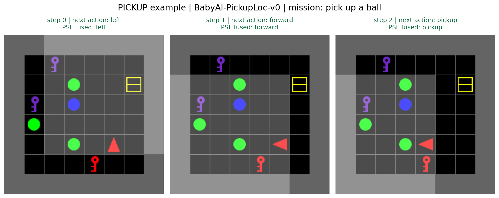
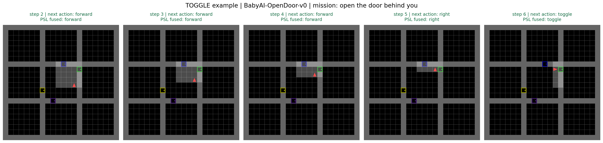
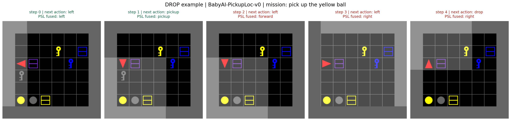

# neupsl-intent

`neupsl-intent` is a BabyAI/MiniGrid action-sequence prediction demo for a
Transformer + NeuPSL pipeline.



The teaser shows three real BabyAI trajectory snippets replayed from generated
inference data. Each row compares the expert next action with the pretrained
Transformer prediction and the NeuPSL-trained prediction. The right side
summarizes the one-step inference flow: the same step is encoded for the neural
branch and converted into symbolic rule facts for the PSL branch, then both
sources are fused into `Action(S,A)`.

The core task is:

```text
mission + symbolic observation + expert action history
  -> BabyAIPredictor
  -> next-action probabilities
  -> NeuPSL with symbolic action rules
  -> PSL-fused action prediction
```

The action space is the standard MiniGrid/BabyAI closed action set:

```text
left, right, forward, pickup, drop, toggle, done
```

The project is intended to test whether symbolic rules can improve a neural
sequence model under limited task-specific data, especially when pretraining and
NeuPSL/inference distributions differ.

## Repository Layout

```text
data/
  loader.py                 # Load BabyAI token/type/action partitions.
  sequence_extraction.py    # BabyAIBot trajectory generation and tokenization.
  rule_extraction.py        # Invalid/Plausible action fact extraction.
models/
  transformer.py            # BabyAIPredictor.
  deeppsl.py                # NeuPSL DeepPredicate bridge.
psl/
  runner.py                 # Builds PSL runtime configs and runs PSL.
  rules/experiment__babyai.json
scripts/
  check_env.py
  create_data.py
  export_readme_figures.py
  pretrain_transformer.py
  neupsl_train.py
  evaluate.py
notebooks/
  01_data_exploration.ipynb
  02_training_demo.ipynb
  03_inference_demo.ipynb
docs/
```

Generated data, checkpoints, and results are intentionally not part of source
control.

## Environment

Create or activate the project Python environment, then install dependencies:

```bash
python -m pip install -r requirements.txt
```

For notebook use, register the environment as a Jupyter kernel:

```bash
python -m ipykernel install --user --name .neupsl_env --display-name .neupsl_env
```

Check the runtime:

```bash
python scripts/check_env.py --json
```

MiniGrid/BabyAI trajectory generation uses:

```text
minigrid.utils.baby_ai_bot.BabyAIBot
```

`scripts/create_data.py --generator-backend auto` uses BabyAIBot when MiniGrid is
available. The `synthetic` backend exists only as a fallback smoke-test path.

## Data Preparation

Generate the canonical data split:

```bash
python scripts/create_data.py \
  --pretrain-size 500 \
  --pretrain-valid-size 100 \
  --train-size 50 \
  --valid-size 100 \
  --inference-size 1000 \
  --generator-backend minigrid
```

This creates:

```text
data/experiment_babyai/
  action-vocab.json
  token-vocab.json
  type-vocab.json
  pretrain/
    rules/
      psl-rules.txt
      rule-library.json
    size_0500-valid_0100/
      config.json
      sequence-data-train.jsonl
      sequence-data-valid.jsonl
      entity-data-map.txt
      entity-type-map.txt
      action-target-train.txt
      action-truth-train.txt
      action-target-valid.txt
      action-truth-valid.txt
      invalid-action-train.txt
      plausible-action-train.txt
      invalid-action-valid.txt
      plausible-action-valid.txt
  neupsl-train/
    rules/
    size_0050-valid_0100/
      ...
  inference/
    rules/
    size_1000/
      sequence-data-inference.jsonl
      entity-data-map.txt
      entity-type-map.txt
      action-target-inference.txt
      action-truth-inference.txt
      invalid-action-inference.txt
      plausible-action-inference.txt
```

### Split Semantics

The split unit is an episode. Each successful BabyAIBot episode is expanded into
step-level next-action examples:

```text
step_t = mission + symbolic observation_t + expert action history[:t] -> action_t
```

Current environments:

```text
pretrain:
  BabyAI-GoToObj-v0
  BabyAI-Pickup-v0

neupsl-train and inference:
  BabyAI-PickupLoc-v0
  BabyAI-OpenDoor-v0
```

Only successful, non-truncated episodes with length at least 3 are kept. The
history is the expert prefix, not an autoregressive rollout from model
predictions.

### Tokenization

Each step is encoded as one Transformer sequence:

```text
[CLS] mission tokens [SEP] symbolic observation tokens [SEP] history actions [SEP]
```

The model receives two aligned arrays:

```text
token_ids: token vocabulary ids
type_ids: segment/type ids
```

Token types include:

```text
SPECIAL, MISSION, OBS_AGENT, OBS_FRONT, OBS_TARGET,
OBS_CARRYING, OBS_WORLD, HISTORY
```

`entity-data-map.txt` is the DeepPredicate data map:

```text
step_id  token_ids...  action_id
```

`entity-type-map.txt` stores:

```text
step_id  type_ids...
```

The label at the end of `entity-data-map.txt` is used by the Python neural
bridge for supervised metrics and optional supervised loss.

## Rule Extraction

Rule extraction currently produces two kinds of PSL observation facts:

```text
InvalidAction(Step, Action)
PlausibleAction(Step, Action)
```

They are generated in `data/rule_extraction.py` from symbolic features attached
to each step. Examples:

```text
front_type == wall
  -> InvalidAction(step, forward)

front_type != door
  -> InvalidAction(step, toggle)

front_type == door and front_state == closed
  -> PlausibleAction(step, toggle)

mission_kind == pickup and front_type == target_type
  -> PlausibleAction(step, pickup)

mission_kind == pickup and hand_type == target_type
  -> PlausibleAction(step, done)
```

The generated files are tab-separated PSL observations:

```text
invalid-action-train.txt
plausible-action-train.txt
invalid-action-inference.txt
plausible-action-inference.txt
```

Each row is:

```text
step_id    action_id
```

`rule-library.json` is an inspectable summary of which derived rule templates
were supported in a split. `psl-rules.txt` stores the PSL templates used by the
runtime.

### Legal Rule Candidate Exploration

`notebooks/01_data_exploration.ipynb` also demonstrates a broader legal-rule
mining idea: take successful expert steps, convert each symbolic state into
predicates, count predicate combinations that frequently precede an expert
action, and report candidate rules with support/confidence/coverage.

That exploration is not yet the source of all runtime facts. Runtime currently
uses the conservative hand-selected `PlausibleAction` patterns in
`data/rule_extraction.py`.

## PSL From Theory To Implementation

The high-level PSL model is:

```text
NeuralAction(S,A)       neural probability for action A at step S
Action(S,A)             PSL-fused target predicate
InvalidAction(S,A)      symbolic negative evidence
PlausibleAction(S,A)    symbolic positive evidence
```

The PSL rules are:

```text
1.0: NeuralAction(S, A) -> Action(S, A) ^2
1.0: InvalidAction(S, A) -> ~Action(S, A) ^2
1.0: PlausibleAction(S, A) -> Action(S, A) ^2
Action(S, +A) = 1 .
```

Interpretation:

- `NeuralAction -> Action`: keep the fused decision close to the neural model.
- `InvalidAction -> ~Action`: discourage actions that violate mechanics.
- `PlausibleAction -> Action`: encourage actions supported by task semantics.
- `Action(S,+A)=1`: enforce one categorical action distribution per step.

The template lives in:

```text
psl/rules/experiment__babyai.json
```

### What PSL Receives

`psl/runner.py` builds the concrete runtime config from generated data. It sets:

```text
NeuralAction/2:
  type: DeepPredicate
  targets.learn: action-target-train.txt
  targets.infer: action-target-inference.txt
  entity-data-map-path: combined train + inference token ids
  entity-type-map-path: combined train + inference type ids
  model-path: models/deeppsl.py::BabyAIActionModel

Action/2:
  targets.learn / targets.infer: all step-action pairs
  truth.learn / truth.infer: one-hot expert action labels

InvalidAction/2:
  observations.learn / observations.infer: invalid-action-*.txt

PlausibleAction/2:
  observations.learn / observations.infer: plausible-action-*.txt
```

The runtime writes a concrete config to:

```text
results/babyai_train_50_infer_1000/psl-config.json
```

### DeepPredicate Bridge

`models/deeppsl.py::BabyAIActionModel` is the NeuPSL bridge around
`BabyAIPredictor`.

During prediction, PSL passes step ids to the DeepPredicate. The bridge maps
those ids back to token/type arrays through `entity-data-map.txt` and
`entity-type-map.txt`, runs the Transformer, and returns a 7-way probability
vector as `NeuralAction(S,A)`.

During NeuPSL learning, PSL computes gradients from rule violations and sends
them into the DeepPredicate. The bridge backpropagates those gradients through
the Transformer probabilities and saves the fine-tuned model to:

```text
results/babyai_train_50_infer_1000/model.pt
```

During final inference, PSL combines:

```text
neural probabilities + InvalidAction facts + PlausibleAction facts + simplex constraint
```

and outputs fused `Action(S,A)` atoms to:

```text
results/babyai_train_50_infer_1000/runtime-output.json
```

## Running The Pipeline

### 1. Generate Data

```bash
python scripts/create_data.py \
  --pretrain-size 500 \
  --pretrain-valid-size 100 \
  --train-size 50 \
  --valid-size 100 \
  --inference-size 1000 \
  --generator-backend minigrid
```

### 2. Supervised Pretraining

```bash
python scripts/pretrain_transformer.py \
  --pretrain-size 500 \
  --pretrain-valid-size 100 \
  --epochs 20 \
  --batch-size 64
```

Output:

```text
ckpt/pretrained-babyai-transformer.pt
ckpt/pretrained-babyai-transformer.history.json
```

On Apple MPS, the Transformer disables PyTorch nested tensors in
`models/transformer.py` because one nested-tensor op is not implemented on MPS
in the tested PyTorch version.

### 3. NeuPSL Fine-Tuning And Inference

Start from the pretrained Transformer:

```bash
python scripts/neupsl_train.py \
  --train-size 50 \
  --valid-size 100 \
  --inference-size 1000 \
  --init-mode pretrained \
  --pretrained-path ckpt/pretrained-babyai-transformer.pt \
  --gradient-steps 250 \
  --admm-iterations 200 \
  --batch-size 256
```

Start from scratch instead:

```bash
python scripts/neupsl_train.py --init-mode scratch
```

Output:

```text
results/babyai_train_50_infer_1000/
  psl-config.json
  runtime-output.json
  learned-rules.json
  learned-rules.txt
  model.pt
  checkpoints/
  saved-networks/nesy-trained-pt/model.pt
  out.txt
  out.err
```

### 4. Summarize Results

```bash
python scripts/evaluate.py \
  --train-size 50 \
  --valid-size 100 \
  --inference-size 1000
```

This writes or updates:

```text
results/babyai_train_50_infer_1000/metrics.json
```

## Notebooks

### `01_data_exploration.ipynb`

Shows:

- split sizes and action distributions,
- scene reconstruction with MiniGrid rendering,
- action timeline over an episode,
- token/type sequence view,
- rule facts for the same episode,
- legal rule candidate mining from expert trajectories,
- t-SNE-style projection of sequence examples.

Use this notebook to inspect whether generated data, tokenization, and rule
facts match the intended task semantics.

### `02_training_demo.ipynb`

Shows:

- loading existing generated data,
- checkpoint reuse or supervised pretraining if the checkpoint is missing,
- validation accuracy before NeuPSL,
- NeuPSL fine-tuning,
- validation accuracy after NeuPSL,
- visual comparison over the final steps of several validation episodes.

The visualized predictions are:

```text
true     BabyAIBot expert next action
Neural   pretrained Transformer prediction
NeuPSL   neural checkpoint prediction after NeuPSL fine-tuning
```

### `03_inference_demo.ipynb`

Shows:

- loading the inference split,
- parsing PSL fused `Action` atoms from `runtime-output.json`,
- comparing pretrained Neural, NeuPSL checkpoint, and PSL fused predictions,
- trajectory-end visualizations selected to cover different target actions
  where available, currently `pickup`, `toggle`, and `drop` if present.

The visualized predictions are:

```text
true     BabyAIBot expert next action
Neural   pretrained Transformer prediction
NeuPSL   fine-tuned neural checkpoint prediction
PSL      fused Action prediction from PSL inference
```

With the current local run, inference produced:

```text
examples: 7046
Neural accuracy: 0.3494
NeuPSL checkpoint accuracy: 0.8459
PSL fused Action accuracy: 0.8399
PSL prediction coverage: 1.0
```

### Inference Scene Examples

The README figures below are exported from the same inference artifacts used by
`03_inference_demo.ipynb`:

```bash
python scripts/export_readme_figures.py
```

Each panel is the rendered MiniGrid state before the next expert action. The
title reports:

```text
next action    BabyAIBot expert label for the current step
PSL fused      argmax over PSL's fused Action(S,A) atoms
green title    PSL fused prediction matches the expert action
red title      PSL fused prediction differs from the expert action
```

Pickup example:



This short `PickupLoc` episode shows the agent rotating, moving toward the
target ball, and then selecting `pickup`. The symbolic rule evidence marks
`pickup` as plausible when the target object is directly in front of the agent,
so the fused PSL prediction agrees with the expert at the decisive step.

Toggle example:



This `OpenDoor` episode shows the agent navigating to a door and finally
selecting `toggle`. The rule observations discourage `toggle` when the object in
front is not a door, and support `toggle` when a closed door is in front. The
last frame is therefore a clean case where the neural prediction and symbolic
mechanics align.

Drop example:



`drop` is intentionally included as a limitation example. In the current
`PickupLoc`/`OpenDoor` inference split, `drop` appears only once and is not a
primary goal template. PSL correctly follows the early pickup-related steps, but
the fused prediction misses the rare final `drop`. This is useful diagnostic
evidence that the current rule library and data mix are still biased toward
navigation, pickup, and door-opening behavior.

## Current Limitations

- Runtime legal-action rules are conservative and mostly hand-selected from
  MiniGrid/BabyAI semantics. The notebook demonstrates broader rule mining, but
  those mined candidates are not yet automatically promoted into PSL runtime
  rules.
- The first task family uses closed-domain 7-way action classification, not
  open-ended action arguments.
- Current inference environments are `PickupLoc` and `OpenDoor`; `drop` may
  appear as an expert action but is not an independent goal class.
- Generated data scale is counted by episode, then expanded to step-level
  examples. Episode-level splitting avoids train/valid leakage through
  overlapping prefixes.
